# β-boost
### _Special Relativity Simulator in Unity_

## Description
This project aims to allow anyone to experience the effects of special relativity, well
below the extreme velocities required in reality. By constructing a special relativity
simulation within the context of a computer game, the player of the game will get a
better intuition of some notable relativistic effects such as length contraction, Lorentz
boosts, coordinate transformations and more.

## Content
1. `PlayerController.cs` - Controls the playable character. Based on the following player controller from Unity: [Starter Assets - ThirdPerson](https://assetstore.unity.com/packages/essentials/starter-assets-thirdperson-updates-in-new-charactercontroller-pa-196526?srsltid=AfmBOorK0biqhhL-1w10QyQ8-k_B-XmCcJ50nZA-1Nb8Vv9RkoAjo4BW)
2. `LorentzTransform.cs` - Contructs the Lorentz transformation matrix from the player's velocity parameters.
3. `VertexManager.cs` - Applies a Lorentz boost to mesh vertices for relativistic effects.
4. `MinimapScript.cs` - Handles player control, physics, and camera.
5. `SpeedDisplay.cs` - Displays the player's speed, $\beta$-factor and Lorentz factor on the UI.

## Code hierarchy 
This overview was generated by Google's 𝐠𝐞𝐦𝐢𝐧𝐢-𝟐.𝟓-𝐩𝐫𝐨-𝐩𝐫𝐞𝐯𝐢𝐞𝐰-𝟎𝟓-𝟎𝟔 model

```mermaid
%%{init: {
  "theme": "base",
  "themeVariables": {
    "fontFamily": "Inter, ui-sans-serif, system-ui",
    "fontSize": "16px",
    "primaryColor": "#e8f0fe",
    "primaryTextColor": "#0f172a",
    "primaryBorderColor": "#93c5fd",
    "lineColor": "#334155",
    
    "actorTextColor": "#0f172a",
    "actorBorder": "#94a3b8",
    "noteBkgColor": "#fff7ed",
    "noteTextColor": "#7c2d12",
    "activationBkgColor": "#c7d2fe",
    "sequenceNumberColor": "#0ea5e9"
  }
}}%%
sequenceDiagram
    title β-boost Simulation Loop

    autonumber

    %% ─────────── Layers
    box rgb(235,245,255) Player & Input
        participant Input as Unity Input System
        participant Player as PlayerController.cs
    end

    box rgb(245,247,255) Math & Transform
        participant Lorentz as LorentzTransform.cs
    end

    box rgb(240,250,245) Environment & Rendering
        participant VManager as VertexManager.cs
        participant Meshes as Unity Meshes (envRoot)
    end

    box rgb(248,245,255) UI & Tools
        participant SpeedUI as SpeedDisplay.cs
        participant Minimap as MinimapScript.cs
        participant Theory as TheoryCheck.cs
    end

    %% ─────────── Initialization
    Note over VManager,Meshes: Initialization (Start)
    VManager->>Meshes: Deep Copy original meshes<br/>Cache "Rest Frame" vertices (S)

    %% ─────────── Main Loop
    loop Game Update Cycle
        %% 1. Input & Physics
        Input->>Player: OnMove / OnJump
        activate Player
        Player->>Player: Update Velocity, Ground Check
        Player->>Player: Calc Relativistic Props<br/>(β, γ, v̂)
        deactivate Player

        %% 2. Parallel Visual Updates
        par Visual Distortion (CPU)
            activate VManager
            VManager->>Player: Get Position & β⃗
            VManager->>Lorentz: Get Property "Lambda"
            activate Lorentz
            Lorentz->>Player: Read β, γ, v̂
            Lorentz->>Lorentz: Construct Matrix Λ
            Lorentz-->>VManager: Return Λ (4x4 Matrix)
            deactivate Lorentz
            
            VManager->>VManager: Loop all cached vertices:<br/>1. Calc relative pos (ct, x, y, z)<br/>2. Apply X' = ΛX<br/>3. Convert to World Space
            VManager->>Meshes: Apply vertices & RecalculateBounds
            deactivate VManager

        and UI Updates
            activate SpeedUI
            SpeedUI->>Player: Read β, γ, Speed
            SpeedUI->>SpeedUI: Update Canvas Text
            deactivate SpeedUI

        and Minimap (LateUpdate)
            activate Minimap
            Minimap->>Player: Read Transform
            Minimap->>Minimap: Match X/Z position<br/>Rotate Icon
            deactivate Minimap
        end

        %% 3. Optional Diagnostics
        opt User presses 'M'
            activate Theory
            Theory->>Meshes: Read current Bounds (Measured L')
            Theory->>Player: Read β, v̂
            Theory->>Theory: Calculate Expected L'<br/>Compare & Log Error %
            deactivate Theory
        end
    end
```

